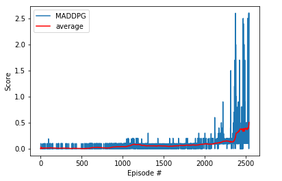

## Learning Algorithm
Based on my learning from the previous project (Continuous Control) and Udacity's Multi-Agent RL example, I decided to reuse a big chunk of existing code. The solution uses a Multi Agent Deep Deterministic Policy Gradients ([MADDPG](https://arxiv.org/pdf/1706.02275.pdf)). It builds on top of DDPG which in turn is an enhancement of deep Q-learning algorithm(DQN). Multi-agent systems learn to perform complex tasks while simultaneously collaborating and/or competing with other agents.

The environment for the project requires the training of two separate agents, and the agents need to collaborate under certain situations (don't let the vall hit the ground) and compete under other situations (get as many points as possible). In our case, each agent in this model has its own actor and critic model. Each actor receive individual state or observations as input and provide action as output. The critic model of each actor receives the states and actions of all actors. The agents use a common experience replay buffer during training. 

It took many iterations of tweaking hyperparams and rerunning the model. The results were not consistent. I started with a list of params I was going to modify and experiment. I updated one parameter a time with extreme value first, trained, tweaked the param again to see the impact on performance and continued with the next.

### Why MADDPG
To model more real-world scenario, we need multi-agent systems which learn to perform complex tasks while simultaneously collaborating and/or competing with other agents. The more complex the task, more likely that multi-agents are needed. One of the advantages of a multi-agent approach is this additional factor of learning via cooperation or competition. Instead of one agent trying to master several tasks, the tasks can be divided among multiple agents and one can agent can utilize the knowledge acquired by the other. This ensures solving much more complex tasks modeling real-world situations such as simulating a self-driving car or in our case playing tennis.

### Approaches
Individually every agent in this model is modeled as a Deep Deterministic Policy Gradient agent but some information is shared between the agents. For example, earch of the agents in this model has its own actor and critic model. The actors receieve as input the individual state (observations) of the agent and output a two dimensional action. The critic model of each actor, however, receives the states and actions of all actors concatenated. This should facilitate the information sharing between the agents. During training, the agents use a common experience replay buffer and draw independent samples.

### Noise
I used noise to allow the agents to explore new possibilities during training. Started with an initial amount and keep it constant until a certain number of overall time steps, in my case 4000.

### Hyperparameters why
- Buffer Size = 10000 (Trial and error. Started with 100k)
- Batch Size = 64 (Trial and error. Started with 256. Performance was getting worse with higher numbers and so I started lowering and this seems to work best for me)
- Noise Start = 0.5 (Trial and error. Didn't experiment much with it)
- Noise Decay = 1.0 (Trial and error. Didn't experiment much with it)
- Update Interval = 2 (Trial and error. Started with 4 and lowered to 2. This seems to work)
- Gamma/Discount Factor = .9999 (Most of the Udacity's examples use a fraction close to 1 for the discount factor and it was recommended several time early on and I stuck to it)
- tau = 1e-3 (Didn't play with this at all. A relatively low value since target networks are updated after each step)
- learning rate (actor) = 1e-4 (Trial and error)
- learning rate (critic) = 3e-4 (Trial and error)

### Model architecture for Actor/Critic
I reused the code from the last project which I started with Udacity's example code on DDPG. I experimented very little with the number of hidden layers and neurons as my training was taking too long and the average score was not improving. The architecture for Actor Critic uses 2 fully connected hidden layers with ReLu activation function for both Actor and Critic. Based on some recommendations from other studends, I also used batch normalization in both Actor and Critic

- Actor
  - Hidden: (input, 256) - ReLU
  - Hidden: (256, 256) - ReLU
  - Output: (256, 4) - TanH

- Critic
  - Hidden: (input, 256) - ReLU
  - Hidden: (256, 256) - ReLU
  - Output: (256, 1) - Linear

## Network Architecture
I didn't change much from the basic implementation in terms of number layers. The network architecture is made up of two fully connected hidden layers with 256 units and ReLu action function for both actors and critics. In order to help speed up learning and avoid getting stuck in a local minimum, batch normalization was used for each hidden layer for both actor and critic networks. Tanh activation function was used on the output layer for the actor-network as it ensures that every entry in the action vector is a number between -1 and 1. Adam optimizer was used for both actor and critic networks.

## Hyperparameters
- Buffer Size = 10000
- Batch Size = 64
- Noise Start = 0.5
- Noise Decay = 1.0
- Update Interval = 2
- Gamma/Discount Factor = .9999
- tau = 1e-3
- learning rate (actor) = 1e-4
- learning rate (critic) = 3e-4

## Plot of Rewards

## Ideas for Future Work
- Experiment with incorporating prioritized replay. It should help further reduce the correlations so that there is less bias in the agent's training while it learns the optimal policy.
- Experiment using Multi-Agent Proximal Policy Optimization (MAPPO) to see how it compares to MADDPG.
